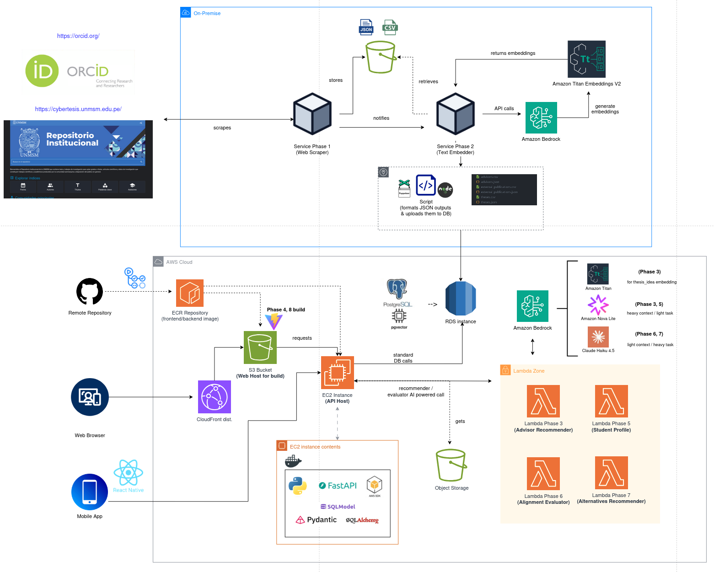

# FISI Match - Sistema Inteligente de Recomendación de Asesores de Tesis

> **Plataforma híbrida de recomendación semántica y evaluación de alineación académica para estudiantes de Ingeniería de Software y Sistemas.**

Desarrollado con almacenamiento vectorial y relacional en PostgreSQL (`pgvector`) y orquestación serverless en AWS Lambda utilizando LLMs de vanguardia en AWS Bedrock.

---

## Descripción del Proyecto

Uno de los mayores retos para los estudiantes de pregrado al iniciar su tesis es tomar decisiones clave sin suficiente información:
* **Desconocimiento** de las líneas de investigación reales y vigentes de los profesores.
* **Falta de visibilidad** sobre las tesis previamente asesoradas por cada docente.
* **Incertidumbre** sobre si el perfil académico del propio estudiante (cursos aprobados, habilidades, experiencia) está alineado con la idea de investigación propuesta.

**FISI Match** resuelve esta problemática de forma integral:
1. **Recomienda Asesores Ideales**: Conecta semánticamente la propuesta de tesis del estudiante con las publicaciones y tesis supervisadas de la plana docente.
2. **Justifica y Muestra Evidencia**: Proporciona explicaciones detalladas (RAG) del porqué de la recomendación con citas reales de su trabajo previo.
3. **Evalúa la Alineación**: Analiza el historial académico del alumno y su CV para estimar su nivel de preparación semántica respecto al tema de tesis propuesto, sugiriendo rutas de aprendizaje y temas alternativos en caso de brechas de habilidades.

---

## Arquitectura del Sistema y Flujo de Datos

El sistema combina componentes relacionales y vectoriales locales junto con procesamiento inteligente bajo demanda en la nube de AWS.

### Diagrama General de Arquitectura



---

## Estructura del Repositorio

El repositorio está organizado en fases numeradas secuenciales y directorios dedicados a servicios principales:

*   **`1-scraper/`**: Crawler y scraper en Node.js para recopilar información de profesores de la FISI, sus ORCID correspondientes, publicaciones científicas en Scopus/Google Scholar y tesis asesoradas en **Cybertesis UNMSM**.
*   **`2-text-embedding/`**: Pipeline para la fragmentación y vectorización de la metadata de los docentes (publicaciones, tesis y perfiles) utilizando el modelo **AWS Bedrock Titan Embeddings v2**.
*   **`3-advisor-recommend/`**: Módulo en AWS Lambda y script local que implementa la búsqueda semántica kNN y la generación estructurada de explicaciones RAG.
*   **`5-student-profile-reader/`**: AWS Lambda y scripts locales que procesan PDFs académicos (historiales de notas, matrículas de la UNMSM y CVs) mediante parsing de texto (`pdfplumber`) y LLM (**Bedrock Nova Lite**).
*   **`6-alignment-evaluator/`**: AWS Lambda y CLI local que compara las habilidades inferidas del tema de tesis propuesto contra las competencias del estudiante usando **Claude Haiku 4.5**.
*   **`7-alternative-recommender/`**: Módulo AWS Lambda para la sugerencia inteligente de cursos de reforzamiento, microproyectos y temas de tesis alternativos basados en las brechas del perfil.
*   **`backend/`**: Aplicación FastAPI (Python) estructurada con `SQLModel` que centraliza la API pública del sistema y se comunica de manera segura con AWS.
*   **`frontend/`**: Aplicación web SPA moderna desarrollada con React 19, TypeScript, Vite y **Tailwind CSS v4**.
*   **`mobile/`**: Aplicación móvil multiplataforma desarrollada en **React Native / Expo** y estilada dinámicamente con **Uniwind**.
*   **`db/`**: Definición del esquema de la base de datos relacional y scripts para el sembrado inicial (`seed/`) de asesores, vectores y catálogos relacionales.


---

## Conceptos Clave del Motor de Recomendación

### 1. Estrategia Multivectorial por Asesor (1:N)
En lugar de promediar las publicaciones e intereses de un profesor en un único vector (lo que diluiría su significado semántico), FISI Match implementa una **estrategia de múltiples vectores por asesor**. 
Cada vector en la tabla `knowledge_vectors` representa un fragmento independiente:
*   Un vector para el **perfil biográfico** del profesor.
*   Un vector por cada **tesis asesorada** en el pasado.
*   Un vector por cada **publicación de investigación** registrada.

Esto permite al motor kNN emparejar la idea del estudiante con aspectos sumamente específicos del trabajo del docente (ej. si el profesor asesora en Inteligencia Artificial y además tiene una tesis específica sobre Redes Neuronales de Convolución, la búsqueda vectorial capturará esa especialización de forma precisa).

### 2. Embeddings y Búsqueda de Similitud Vectorial
*   **Modelo**: `amazon.titan-embed-text-v2:0` (1024 dimensiones).
*   **Indexación**: Índice **HNSW** (Hierarchical Navigable Small World) configurado para **distancia coseno** (`vector_cosine_ops`) en `pgvector`.
*   **Búsqueda Semántica**: Búsqueda k-Nearest Neighbors (kNN) eficiente sobre más de 2,300 fragmentos vectorizados de conocimiento.

### 3. Explicabilidad con LLMs en la Nube
Una vez recuperados los fragmentos con mayor similitud semántica para los asesores del Top-K, el sistema invoca **AWS Bedrock Anthropic Claude** para generar una justificación escrita coherente basada exclusivamente en las coincidencias reales (publicaciones y tesis) aportadas como evidencia contextual.

---

## Guía de Configuración e Inicio Rápido

> IMPORTANTE: Se debe contar con una cuenta de AWS activa y configurada, con acceso a los Servicios usados en este proyecto (en especial para el acceso a LLMs).

### Prerrequisitos
*   Docker y Docker Compose.
*   Python 3.11+ y Node.js 18+ (con npm o bun).
*   Credenciales válidas de AWS (con acceso a AWS Bedrock).

---

### 1. Base de Datos Local y Seeding

1. Levanta el contenedor de PostgreSQL con soporte para `pgvector`:
   ```bash
   cd db
   docker compose up -d
   ```
2. Instala dependencias y siembra la base de datos con los asesores y vectores procesados de las fases 1 y 2:
   ```bash
   cd seed
   pip install -r requirements.txt
   cp .env.example .env # Configura las variables para apuntar a localhost
   
   # Carga los profesores y vectores semánticos
   python seed.py
   
   # Carga la información relacional complementaria (tesis completas, publicaciones, catálogos)
   python seed_catalog.py
   ```

---

### 2. Backend API (FastAPI)

1. Crea y activa un entorno virtual en Python:
   ```bash
   cd ../backend
   python -m venv .venv
   source .venv/bin/activate
   ```
2. Instala dependencias:
   ```bash
   pip install -r requirements.txt
   ```
3. Configura el archivo de variables de entorno `.env` en `backend/` con tus credenciales de base de datos local y AWS Lambdas/SSO.
4. Inicia el servidor de desarrollo:
   ```bash
   uvicorn app.main:app --reload --port 8000
   ```

---

### 3. Frontend Web (React 19)

1. Instala dependencias:
   ```bash
   cd ../frontend
   npm install
   ```
2. Inicia el servidor de desarrollo Vite:
   ```bash
   npm run dev
   ```
---

### 4. Aplicación Móvil (React Native + Expo)

1. Instala dependencias de la app móvil:
   ```bash
   cd ../mobile
   npm install # o bun install
   ```
2. Inicia el entorno de desarrollo de Expo:
   ```bash
   npx expo start
   ```
---

## Convenciones de Desarrollo y Lambdas AWS

Las fases operacionales complejas (Fases 3, 5, 6 y 7) están desacopladas en carpetas independientes para su despliegue como **AWS Lambdas**.
*   **Empaquetado de Dependencias**: Algunas dependencias de Python (como `psycopg2-binary` para PostgreSQL) requieren arquitecturas Linux específicas para correr en Lambda. Para construir los paquetes de despliegue zip compatibles, se recomienda **siempre** usar el script bash de compilación de Terraform provisto en cada módulo:
    ```bash
    cd 3-advisor-recommend/terraform
    bash build.sh
    terraform init
    terraform apply
    ```
    *No crear zips manuales desde un entorno Windows/macOS local, ya que esto puede generar fallas de enlazado dinámico en AWS.*


